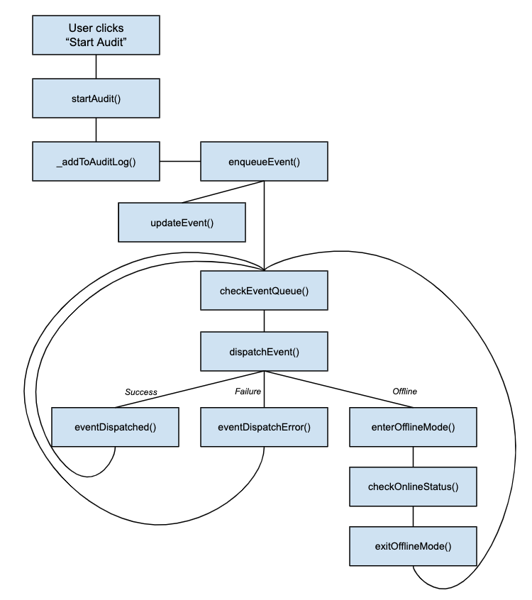

# Redux Store README

## License

Copyright 2019 City of Los Angeles.

Licensed under the Apache License, Version 2.0 (the "License");
you may not use this file except in compliance with the License.
You may obtain a copy of the License at

    [http://www.apache.org/licenses/LICENSE-2.0](http://www.apache.org/licenses/LICENSE-2.0)

Unless required by applicable law or agreed to in writing, software
distributed under the License is distributed on an "AS IS" BASIS,
WITHOUT WARRANTIES OR CONDITIONS OF ANY KIND, either express or implied.
See the License for the specific language governing permissions and
limitations under the License.

## Offline Events

A design goal of the app is to perform an audit when the mobile phone is offline or is only intermittently online.
We also want the app to recover instantly from an app restart, by saving details of the UI state and restoring them automatically on app restart.
The `eventQueue` redux domain facilitates this, by providing a (localstorage-based) persistent queue of events which need to be sent to the server.

An "event" in this context is an audit event (`start_audit`), vehicle event (`end_trip`) or telemetry event. Events go through various phases as encoded in `event.status`:

- `telemetry`: Awaiting telemetry data from the browser
- `ready`: In the event queue, ready to be sent to the server
- `in_flight`: Indicates this event is currently being sent to the server
- `submitted`: Submitted successfully to the server
- `skipped`: Event was skipped, most likely a `telemetry` event for which the browser telemetry promise timed out.
- `error`: There was an error sending the event to the server.

The basic pattern is this:

- The user pushes "Start Audit" button which calls action:
- `audit.startAudit()` => sets up parameters particular to the `start_audit` event, then eventually calls
- `audit._addToAuditLog()` => adds the event to `audit.auditLog` and then calls:
- `eventQueue.enqueueEvent()` => gets (async) telemetry data for the event, then adds a mirror copy of the event (with the same `event.evemtId`) to `eventQueue.queue` - Note that at this point we have **two copies** of the event -- one in the `audit.auditLog` and one in `eventQueue.queue`: - The `auditLog` is used to display **all** events for the current audit, whether they have been sent to the server or not. When a new audit is started, the `auditLog` is cleared. - The `queue` is used to store events waiting to be sent to the server, **for any audit**. As events are dispatched to the server, they are removed from the `queue`. - As events move through this pipeline, the `eventQueue.updateEvent()` action modifies the `status` of the event. Both the `audit` and `eventQueue` domains will watch this action and update their respective copies of the event.
- `eventQueue.checkEventQueue()` is called, which notices that there is no `in_flight` event and so calls:
- `eventQueue.dispatchEvent()` which actually makes the server call. This then calls one of the follwing: - `eventQueue.eventDispatched()` on success, which removes the event from the queue, or - `eventQueue.eventDispatchError()` on failure if NOT a network error, or - `eventQueue.enterOfflineMode()` Called if we're offline, this resets the in-flight event (so we'll try it again later) and starts a periodic check to see if we're online again.
- In any case, once the event has finished dispatching (or we're online again), `checkEventQueue()` is called again to pull the next event in the eventQueue.

Getting telemetry data is managed by the eventQueue: during `eventQueue.enqueueEvent()` we check the `telemetryPolicy` of the event, which will have one of the following values:

- `none`: Don't get telemetry data for the event
- `optional`: Attempt to get telemetry data, if it fails, go ahead and send the event to the server without telemetry data. This is used for all "audit" and "vehicle" events.
- `required`: Attempt to get telemetry data -- if it fails, skip the event (do not send to the server). This is used for standalone "telemetry" events, which are meaningless without actual telemetry data.

## ACTIONS pattern

To reduce boilerplate when setting up redux domains (a.k.a. namespaces), this application uses a set of utilities found in `src/store/store_utils.js` to streamline creating redux domains.

- Each redux domain is defined in its own file.
- Action creators and action handlers are co-located in a single `ACTIONS` within that file, so the logic to dispatch an action is close to the logic used to modify the state. - Across the entire app, there MUST be only one action **creator** for a given action name. - However, you may provide multiple **handlers** for a given action -- for example, a generic `logout` action might be handled in multiple redux domains. - `redux-thunk` can be used to examine store state during an action creator or to dispatch more than one action in response to an action creator. - Because action names are generally only used within each domain file, there is no need to export action names as constants.
- Once the `ACTIONS` object has been set up, utilty routines from `store_utils` are used like so: - `getActionCreators(ACTIONS)` returns a map of action creators. These will be bundled together into a single set of app-wide actions (in `store/index.js`) - `getHandlers(ACTIONS)` returns a map of action handlers. You can use these handlers to re-use an action handler's logic from within another action handler. - `createReducer(ACTIONS, INITIAL_STATE, [localStorageKey])` is used to set up a reducer for this domain. If `localStorageKey` is defined, the store state for this domain will automatically be serialized to localStorage when the an action handler is invoked. When the app restarts, the initial store state will be re-loaded from localStorage. - Use the `connectComponent()` helper to create Higher-Order Components easily.
- `src/store/index.js` then pulls everything together: - `actions` from each domain are merged into a single `actions` map - `reducer`s from each domain are combined into a single store-wide reducer - The `createAppStore()` utility method sets up a default `store` for use in the browser. - Note that for unit/integration testing you'll want to create a different `store` which does not use browser history. foo
